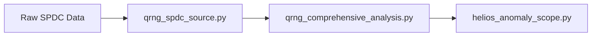

# Helios Analysis Pipeline Overview

## Architecture Diagram



## Purpose & Assumptions

### Module Descriptions

- **`qrng_spdc_source.py`**: Processes raw SPDC quantum data into structured time-series with timestamped quantum events and noise metrics.

- **`qrng_comprehensive_analysis.py`**: Performs full statistical analysis of quantum noise, including entropy calculations, spectral decomposition, and anomaly scoring.

- **`helios_anomaly_scope.py`**: Identifies and scopes potential anomalies by correlating statistical deviations with environmental and hardware metrics.

## Troubleshooting Guide

### CUDA Out of Memory (OOM)

**Symptoms**: `CUDA out of memory` errors during analysis.

**Solutions**:
1. Reduce batch size in data loading configuration
2. Enable mixed-precision training in PyTorch (`torch.set_default_dtype(torch.float16)`)
3. Clear CUDA cache between operations: `torch.cuda.empty_cache()`
4. Process data in smaller chunks using streaming approach

### NaN Values in Entropy Calculations

**Symptoms**: `nan` or `inf` values returned by entropy functions.

**Causes**:
- Insufficient data points for statistical estimation
- Uniform distribution (zero variance)
- Invalid binning parameters

**Solutions**:
1. Ensure minimum data points: `min_data_points >= 50` for Shannon/Rényi, `>= 100` for KS entropy
2. Check input data variance: `np.var(data) > 1e-10`
3. Adjust binning: increase `n_bins` or use adaptive binning
4. Use robust estimators with built-in NaN handling

### Memory Leaks

**Symptoms**: Gradual memory growth during long-running analysis.

**Solutions**:
1. Explicitly delete large objects: `del large_array; gc.collect()`
2. Use generators for streaming data instead of loading entire datasets
3. Limit figure caching in visualization module
4. Monitor memory with `torch.cuda.memory_allocated()`

## Best Practices

### Data Preprocessing

```python
from helios.qrng_spdc_source import SPDCDataProcessor

# Initialize processor
processor = SPDCDataProcessor(
    sampling_rate_hz=1000,
    buffer_size=10000,
    window_size=500,
    overlap=0.5
)

# Process raw data
time_series, metadata = processor.process(raw_data_file)
```

### Running Comprehensive Analysis

```python
from helios.qrng_comprehensive_analysis import QRNGComprehensiveAnalyzer

# Initialize analyzer
analyzer = QRNGComprehensiveAnalyzer()

# Run analysis
results = analyzer.analyze(time_series, metadata)

# Access results
print(f"Shannon Entropy: {results['shannon_entropy']}")
print(f"Kolmogorov-Sinai Entropy: {results['ks_entropy']}")
```

### Anomaly Detection

```python
from helios.helios_anomaly_scope import HelioAnomalyScope

# Initialize anomaly scope detector
scope = HelioAnomalyScope()

# Detect anomalies
anomalies, scopes = scope.detect(time_series, metadata)

# Process results
for anomaly in anomalies:
    print(f"Anomaly at t={anomaly['timestamp']}, score={anomaly['score']}")
```

## Integration with Testbed

The Helios analysis pipeline can be integrated with the consciousness-emergence-testbed by:

1. Using `qrng_spdc_source.py` as a data preprocessing module
2. Leveraging `qrng_comprehensive_analysis.py` for entropy calculations in testbed experiments
3. Applying `helios_anomaly_scope.py` for anomaly detection in consciousness metrics

## Dependencies

- `numpy`: Numerical computations
- `scipy`: Statistical functions and signal processing
- `torch`: GPU-accelerated tensor operations (optional)
- `cuQuantum`: CUDA quantum computing library (optional, requires NVIDIA GPU)

## License

MIT License - See LICENSE file for details.