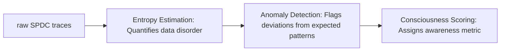

# Helios Trajectory Analysis Architecture

This diagram illustrates the data flow from raw SPDC traces through entropy estimation, anomaly detection, to consciousness scoring.

## Component Overview

### Entropy Estimation
- **Permutation Entropy**: Measures complexity of time series patterns
- **Sample Entropy**: Quantifies regularity and unpredictability
- **Linear Granger Causality**: Detects linear causal relationships

### Chaos Analysis
- **Lyapunov Exponent**: Measures sensitivity to initial conditions
- **Recurrence Plot Analysis**: Visualizes state recurrence patterns
- **Entropy Rate of States**: Calculates information rate in state space

### Epiplexity Estimation
- **Epiplexity (Cross-Validation)**: Cross-fold correlation measure
- **Mutual Information**: Non-linear dependency detection
- **Conditional Entropy**: Information gain analysis

### Influence Detection
- **Granger Causality**: Linear causal inference
- **Mutual Information**: Non-linear influence measurement
- **Conditional Entropy**: Conditional information flow

## Data Pipeline Architecture

The system uses a modular data pipeline with pluggable sources and sinks:

- **SPDCSource**: Loads SPDC quantum randomness traces
- **PRNGSource**: Loads PRNG-generated sequences
- **SaveSink**: Persists processed data to files
- **LogSink**: Logs to console for debugging

## Integration Points

### cuquantum_accelerator/
- Core quantum operations
- Entropy computation
- Tensor analysis
- Quantum simulation

### inference_framework/
- Architecture definitions
- Classifier implementation
- Experiment management
- QRNG bridge integration
